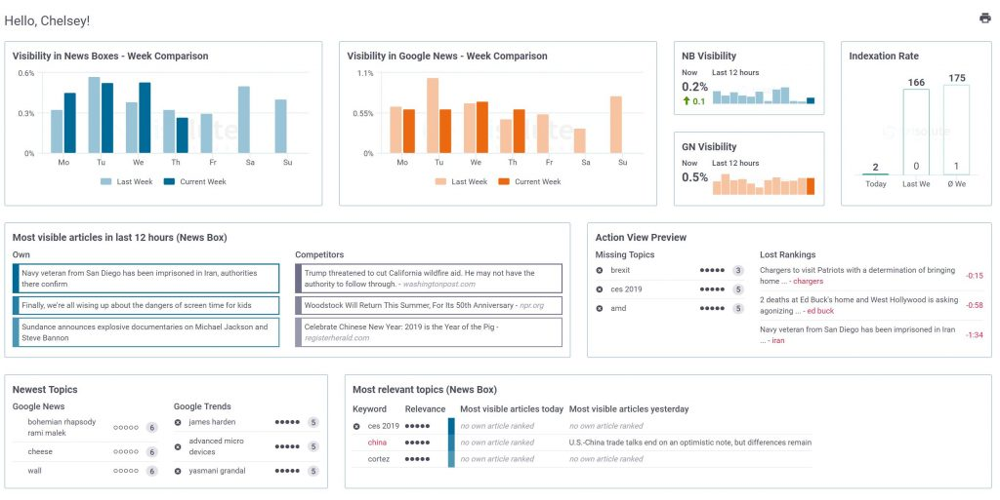

# News Aggregator

- Repository: `news_dashboarding`
- Challenge: `Consolidation`
- Duration: `5 days`
- Deadline: `xx/xx/20xx 17:00`
- Team: `team` (mixed data engineers and data analysts)

## Learning Objectives

| **Data Engineers**            | **Data analysts**           |
|-------------------------------|-----------------------------|
| Scrape websites               | Define needs for reporting  |
| Find and use news API         | Organize project with DE    |
| Store documents               | Explore stored documents    |
| Schedule process              | Create insightful dashboard |
| Deal with document versioning | Create word cloud           |

## The Mission

One of our clients wants to create a dashboard that gives them interesting information about what makes the newspaper headlines.

To achieve this goal, we've gathered different teams mixed with data analysts and data engineers. They will have to find sources that they can use to create an insightful dashboard with.

### Sources 

Define with your team what type of sources and what kind of information you want to gather. Based on that, you'll decide where you want to take your information from: 
- RSS feeds from newspapers (such as [N-Y times](https://www.nytimes.com/rss)) or RSS databases (such as [feedspot](https://rss.feedspot.com/world_news_rss_feeds))
- Website scraping (newspapers, Google News, ...)
- Open-source database (make sure to check they are refreshed regularly!)
- ...

The key information to retrieve is: 
- Source of the news (newspaper, ...)
- Country 
- Topics 
- Title 
- Article (or at least the header or summary)
  
### Data Pipeline

Create a data pipeline that allows you to:
- Gather information from your sources
- Store the info (you need to decide what technology to use)
- Schedule a daily update of your database
- Pay attention to the versioning of the dataset

### Dashboard

Create a dashboard that allows you to monitor the news. Example questions to include are: 
- What are the hot topics by country?
- How many articles are published by country? How many by topic?
- (Optional) Build a tool that recommends similar articles
- (Optional) Determine the overall sentiment of an article (e.g., talking about murdering an innocent child is rather negative, while an NYC marathon article would probably be rather positive) (hint: [HuggingFace](https://huggingface.co/) is a great platform)

### Presentation

Create a small presentation (max. 6 slides) explaining your choices (Which sources? What technology? What information?) and why you are doing this analysis in the first place (= the *business question* you are answering with your dashboard).

The presentation should also show your dashboard specificity and its functionalities.

## Deliverables

1. Publish your source code on a GitHub repository
2. Presentation (Canva, PowerPoint, Prezi, Google Slides, ...) that addresses the following points (and more):
    - The business question (= why)
    - The sources you needed/used (= what)
    - The technology (= how)
    - The result (= output)
    - Your analysis (= pointers for business to make proper decisions or understand the context)
3. Link to a public dashboard

## Steps

1. Plan the work and organize your team
    - Sketch your dashboard 
    - Identify your needs
    - Present it to the coach for feedback
    - Distribute the team roles: 
        - **GitHub Manager**: makes sure the GitHub repository is clean and that branches are logically created and merged.
        - **Project Manager**: makes sure everybody in the team has clarity and stays focused on achieving the predefined goal.
        - **Presentation Manager**: makes sure that the presentation is professional and that everything needed for that presentation is available.
2. Look for sources 
3. Build the pipeline
4. Analyze the data and create the dashboard

## Evaluation

| Criterion      | Indicator                                           | Yes/No |
| -------------- | --------------------------------------------------- | ------ |
| 1. Is complete | The data pipeline is complete                       |        |
|                | The dashboard is updated daily with new content     |        |
|                | You have a nice presentation                        |        |
| 2. Is great    | You can recommend similar articles                  |        |
|                | You can determine the overall sentiment of articles |        |
|                | You have creative information to show               |        |

## A final note of encouragement

_"If you don't read the newspaper, you're uninformed. If you read the newspaper, you're mis-informed." - Mark Twain_

**Nooow... go get some news!!**

